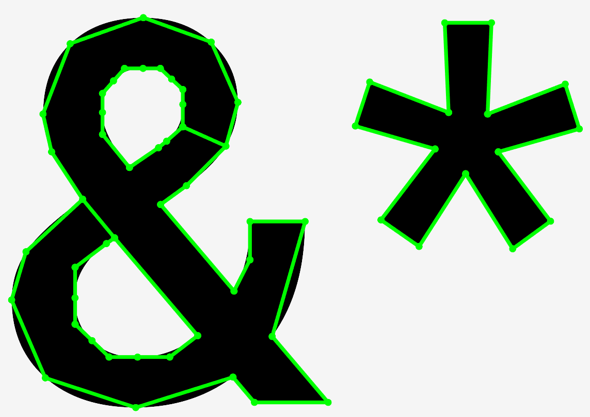
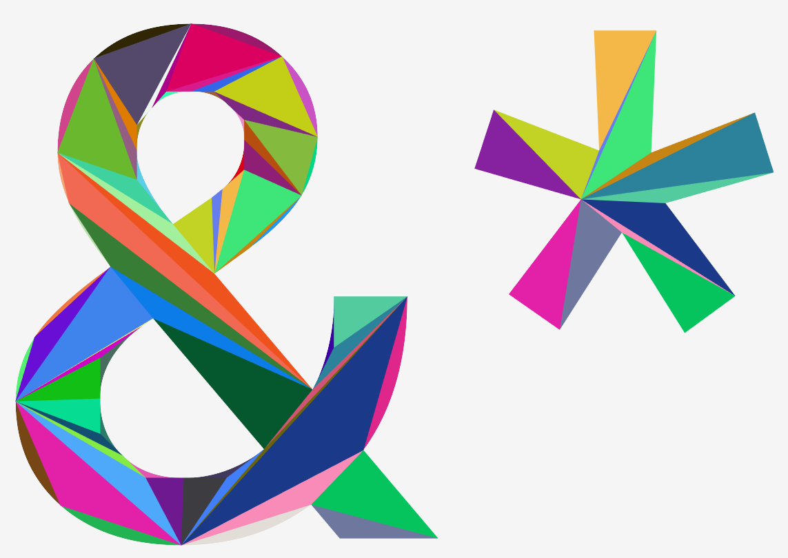
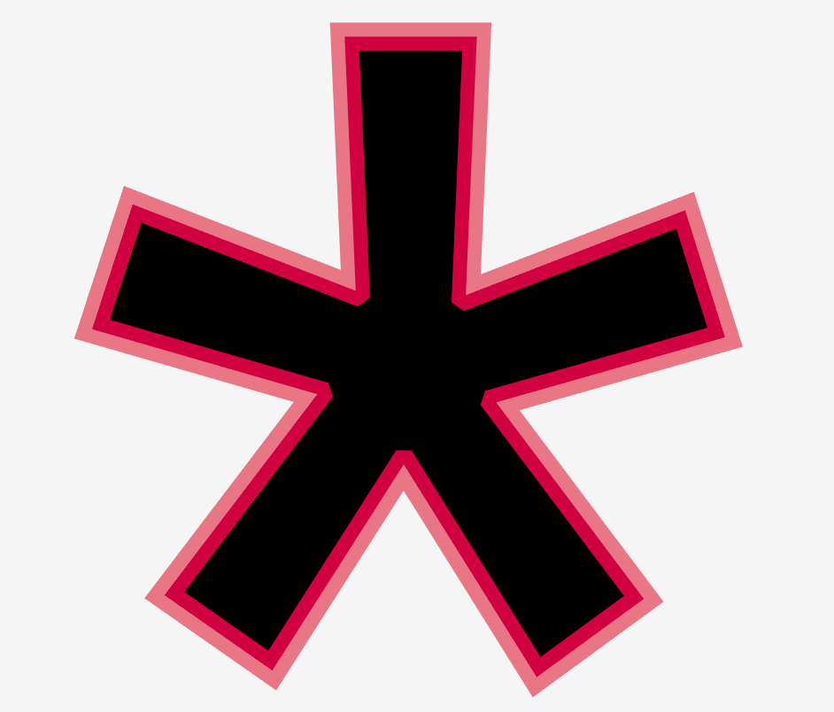

A TrueType font renderer using the method given in [GPU Gems - Chapter 25. Rendering Vector Art on the GPU](https://developer.nvidia.com/gpugems/gpugems3/part-iv-image-effects/chapter-25-rendering-vector-art-gpu). 

# Algorithm
0. Load bezier contours of all glyphs from .ttf file and process them into unified format consitining of `{control point, destination}` (implicit) structures.
   These structures are interated cyclically where the previous destination point is the current start point.
   Linear segments are cannonically expressed with `control point == destination`.
1. Put aside all bezier segments, leaving the polygon outline of the glyph. The bezier segments are removed in winding order senstive manner to ensure the polygon outline is fully inside of the glyph.
2. Seprate contours into solid regions and holes based on winding order
3. Try to merge each solid region with each hole. If the hole is really within that region merge them into a degenerate polygon by adding an appropriate bridge between close vertices.
   I call these resulting outlines "skeleton"s.
4. Triangulate each skeleton using ear clipping
5. Combine the resulting triangles witht the previously put-aside bezier segments. Store these prepared shapes in a cache with format compatible with the GPU shader.
6. Copy and transform (move, rotate, recolor) the appropriate glyph from the glyph cache into the gpu buffer
7. Run shader [GPU Gems](https://developer.nvidia.com/gpugems/gpugems3/part-iv-image-effects/chapter-25-rendering-vector-art-gpu) to draw on screen

| Skeleton | Triangulization | Resulting shape |
|--------------|------------|----------------|
|  |  |  |

# Small text

# Outlines 
This project also supports outlines. First all bezier curves are sampled with given maximum margin of error, then all line segment joints are calculated. Currently I support sharp, rounded and "cut" joints. 
Finally everything is converted into triangles and sent to the GPU like any other buffer. The relevant code can be found [here](TODO).

| Sharp joints | Cut joints | Rounded joints |
|--------------|------------|----------------|
|  |  |  |

All of this is done analytically with zero overdraw. This works fine for relatively simple shapes and/or slim outlines. As soon one increases the width, the outline can start overdrawing iteself. 
As an simple example imagine adding thicker outline around the letter C. At some point the entire inner region will fill up with the outline and the letter becomes sort of O-shaped. This is essentially
what is happening when overdraw is observed except usually on far smaller scale. To see overdraw of outlines use `mode:transparent`.

Is this a good approach - no, for most things not. Calculating the outline and its joints is expensive and overdraw cannot reasonably be prevented. 
It would be better to simply draw in monochrome to some offscreen buffer, fully accepting overdaw and then draw this rasterized outline to the screen using the desired color.

# Problems
This approach is rather finicky and requires *a lot* of tricky code to get right. Conceptually it sits right between the two extremes of font rasterization and takes both of 
their worst aspects.

### Rasterization using point-inside-shape
Run the same algorithm for each pixel/sample of the final image. For each sample check if is inside the bezier contour via raycasting against the solid regions and holes and color appropriately.
Pros:

- requires very litte to no preprocessing and works directly on the contour
- glyph can be easily transformed by applying the inverse transform on the sample position for the given pixel
- handles even malformed self-intersecting or similar contours without any special handling
  
Cons:
- the point-inside-shape procedure needs to be very perfectly and correctly handle all edge cases such as when the samples position is exactly level with a control point or float accuracy problems. To get a feel for the problems watch [Sebastian Lague video "Coding adventure: font rendering"](https://youtu.be/SO83KQuuZvg?si=J0353IHjLJ5TC4eO).  
- can be expensive to calculate for large, complex shapes (not likely to matter for fonts)
- needs to sample multiple times to achieve AA

### Fine triangulization: 
Sample the bezier contours such that the individual line sgements will be indistinguishable from the original curve, then work only with the straight segments. 
Triangulate these outlines using ear cutting algorithm or similar and submit resulting triangles to the standard GPU pipeline.

Pros:
- appart from the initial sampling allows one to work only with linear segments/triangles
- with good triangulization is performant
- good legibility on even small sizes using MSAA which is esentially for free 
- integrates well with other rendering work (triangles require no special handling)
  
Cons:
- need to redo preprocessig when the glyph size changes so that the no triangulization artefacts are visible
- the preprocessing is tricky and malformed outlines such as self-intersecting contours will cause problems

Now this technique requires both triangulization and all the special cases related to it and then some. This is because we need to seperate the shape into the bezier and polygonal part.
It also needs custom shader and the need to do multiple samples to achieve AA (currently no multisampling is done). 
Without multisampling bezier curves have tendecy to degenerate into straight segments, thus the font starts looking rather blocky on small sizes.

The benefits of this method is that no resampling is required for any zoom level and the curves look generally okay on large sizes. The rendering is very cheap, possibly as cheap as the fine triangulization
approach, depening on the number of triangles and their quality. 

All of this puts it in a rather awkward spot. The nice looks on  could be beneficial in things like videogame text, but then for level art one would probably just use texture and for text that is required to be legible
use some more accurate method using conventional glyph atlasses. This also makes it ill-fit for in game UIs and such. 

If I was choosing which method to implement now, I would go with the rasterization using point-inside-shape
approach as I have already developed what *should* be [very robust point-inside-bezier-contour procedure](TODO) which is directly implementable on the GPU. Performance could be drastically improved by splitting the glyph
by each bezier end point, into horizontal chunks. That way a single sample would only need to check 2-4 possible intersections. 

# Missing features
- kerning
- ligatures
- multisample
- edge case around skeleton out of glyph
